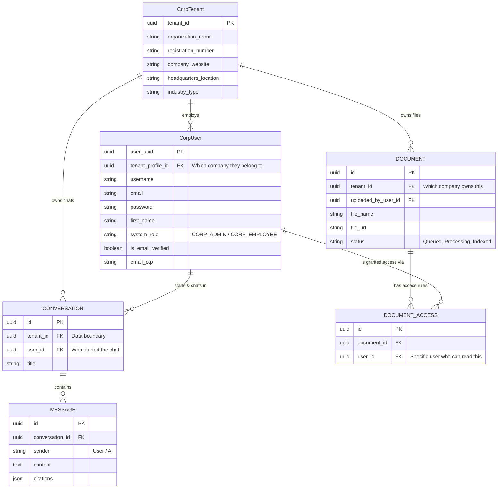

# AI Document Assistant: Database Schema (Optimized Final Version)

## 1. Overview
This is the **Industry Standard Multi-Tenant Architecture**. It uses a single `User` model to handle authentication for everyone, with the `tenant_id` and `role` stored directly on the user. This makes Django authentication seamless while maintaining strict data isolation.

## 2. Entity-Relationship Diagram (ERD)

## 3. Core Tables Breakdown

### 3.1. CorpTenant Table (The Company)
When a user clicks "Register your Company", a new row is created here.
- **`tenant_id` (PK):** Unique UUID identifier.
- **`organization_name`:** Name of the organization (Unique).
- **`registration_number`:** Corporate ID (CIN/GSTIN).
- **`headquarters_location` / `industry_type`:** Company metadata.

### 3.2. CorpUser Table (All Humans)
Handles ALL logins. Django uses this single table for authentication.
- **`user_uuid` (PK):** Unique UUID identifier.
- **`tenant_profile_id` (FK):** Links the user to their Company. This is critical for data isolation.
- **`email` / `password`:** Standard login credentials.
- **`system_role`:** Defines their permissions. Can be `"CORP_ADMIN"` or `"CORP_EMPLOYEE"`.
- **`is_email_verified` / `email_otp`:** Used for the OTP verification flow.

### 3.3. Document Table
Files uploaded by the Admins.
- **`tenant_id` (FK):** Ties the document to the company, ensuring employees from Company B can never see Company A's files.
- **`uploaded_by_user_id` (FK):** Tracks which Admin uploaded it.

### 3.4. Document_Access Table
Controls granular access to specific documents (Role-Based Access Control).
- **`document_id` (FK):** The document being protected.
- **`user_id` (FK):** Allows a specific User (Employee) to access the document.

### 3.5. Conversation Table
The chat history sessions.
- **`tenant_id` (FK):** Ties the chat to the company's data boundary.
- **`user_id` (FK):** Tracks the specific User (Admin or Employee) who started this chat.

### 3.6. Message Table
The individual chat bubbles inside a Conversation.
- **`conversation_id` (FK):** Links the message to its parent thread.
- **`sender`:** Identifies if the sender is `User` or `AI`.
- **`content`:** The text question or the AI's generated answer.
